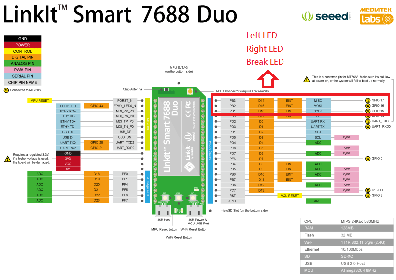
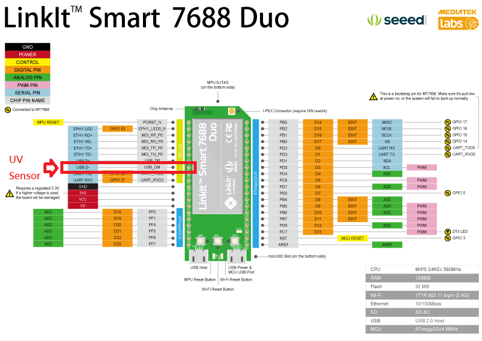

# IntelligentLock
This is a Mobile Hero project that we haven't finished yet.

## Hardware now
Linkit Smart 7688 duo x2

Grove UV sensor: http://wiki.seeed.cc/Grove-UV_Sensor/

## Setting up
**Connect two Linkit Smart 7688 to the same AP**
About Linkit Smart 7688 duo setting reference

Please check http://www.tyes.tc.edu.tw/share/105learn/LinkIt7688.pdf

P.S.

If you are unable to connect http://mylinkit.local in AP mode, you can go to `192.168.100.1`

## Sensor folder
Upload `intelligentlock.ino` to one 7688 for sensor usage

We only programed UV sensor just now

After that, execute `stream.py` file
```
python stream.py
```

## Turn folder
Just execute `stream.py` file, which contains streamimg and LED lighting
```
python stream.py
```

## APP
Import `IntelligentLock.aia` to MIT App Inventor

Change `url_sensor` `url_button` `WebViewer1/2.HomeUrl` to your 7688 IP address and build it

Run on your mobilephone to see a simple demo

It is recommended to write APP by Android Studio instead of AI2

## Pin configuration

### Turn pin


### Sensor pin

